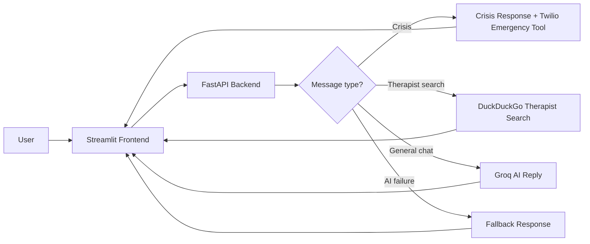
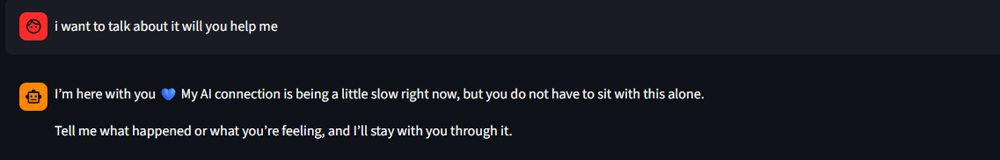
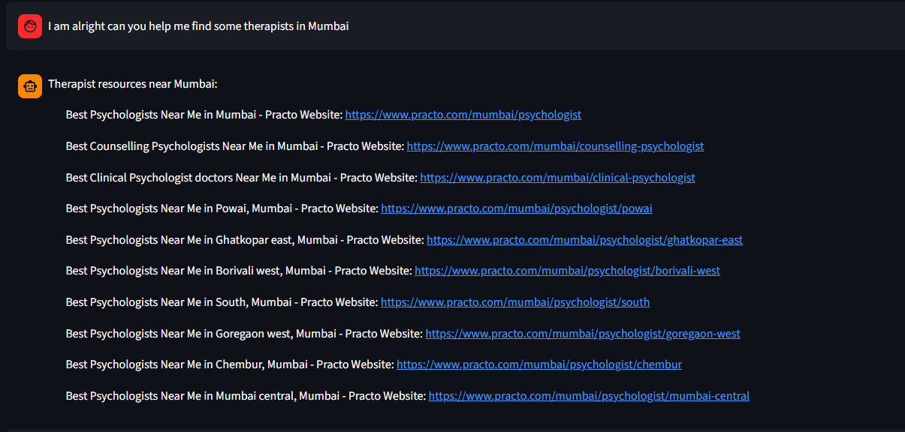

# SafeSpace-AI 🤖🫶

SafeSpace-AI is a mental health support chatbot built with **Streamlit**, **FastAPI**, and AI integrations like **Groq**, **Ollama**, **Twilio**, and **DuckDuckGo Search**.  
It is designed to provide warm conversational support, help users find nearby therapist resources, and respond responsibly when a crisis may be present.

> Live repo: [habeebb21/SafeSpace-AI](https://github.com/habeebb21/SafeSpace-AI)

---

## 1) Business Problem 💡

Many people want a safe place to express stress, sadness, confusion, or emotional overwhelm, but they may not always know where to start.  
At the same time, mental health conversations need to be handled carefully, especially when a user may be in danger or needs professional support.

The problem this project addresses is:
- giving users a simple and friendly way to talk
- providing immediate supportive responses
- guiding users toward therapist resources when needed
- handling crisis-related language with more care and urgency

---

## 2) Possible Solution 🌱

A helpful solution is to build an AI companion that:
- talks in a warm, human-like tone
- keeps the conversation easy and natural
- detects crisis-related language and responds safely
- helps users discover therapist directories by location
- uses a fallback response when the AI model or network is unavailable

This creates a system that is not just conversational, but also more responsible and supportive.

---

## 3) Implemented Solution ✅

This project implements a two-part application:

### Frontend
- A **Streamlit chat interface** for user conversations
- Chat history stored in session state
- Backend availability check before allowing chat

### Backend
- A **FastAPI** service that receives user messages
- Groq-powered AI replies for general conversation
- Crisis detection for urgent safety-related messages
- Therapist search support using DuckDuckGo search
- Emergency call tool integration through Twilio
- Fallback response when AI processing fails

### Key behavior
- If the user message looks like a crisis, the app returns an emergency-focused response
- If the user asks for therapists, the app searches nearby resources
- For normal chat, the app generates a warm AI response

---

## 4) Tech Stack Used 🛠️

- **Python 3.12**
- **Streamlit** — frontend chat UI
- **FastAPI** — backend API
- **Uvicorn** — server runtime
- **Groq** — LLM-powered responses
- **Ollama** — MedGemma-based helper responses
- **Twilio** — emergency call integration
- **DuckDuckGo Search / DDGS** — therapist resource lookup
- **LangChain / LangGraph** — agent and tool structure
- **Pydantic** — request/response validation
- **python-dotenv** — environment variable loading

---

## 5) Architecture Diagram 🧩



---

## 6) How to Run Locally 🚀

### Prerequisites
- Python **3.12**
- A working internet connection
- API keys / credentials for the services you want to use

### 1. Clone the repository
```bash
git clone https://github.com/habeebb21/SafeSpace-AI.git
cd SafeSpace-AI
```

### 2. Create and activate a virtual environment
```bash
python -m venv .venv
.venv\Scripts\activate
```

### 3. Install dependencies
If you are using `uv`, install from the project configuration:
```bash
uv sync
```

If you prefer `pip`, install the packages listed in `pyproject.toml`.

### 4. Configure environment variables
Create a `.env` file in the project root:
```env
GROQ_API_KEY=your_groq_api_key
TWILIO_ACCOUNT_SID=your_twilio_account_sid
TWILIO_AUTH_TOKEN=your_twilio_auth_token
TWILIO_FROM_NUMBER=your_twilio_phone_number
EMERGENCY_CONTACT=your_emergency_contact_number
```

### 5. Start the backend
```bash
cd backend
python main.py
```

This starts the FastAPI server on:
```bash
http://127.0.0.1:8000
```

### 6. Start the Streamlit frontend
```bash
streamlit run frontend.py
```

The UI will usually open at:
```bash
http://localhost:8501
```

---

## 7) References and Resources Used 📚

- [Groq API](https://groq.com/)
- [Streamlit Docs](https://docs.streamlit.io/)
- [FastAPI Docs](https://fastapi.tiangolo.com/)
- [Twilio Voice Docs](https://www.twilio.com/docs/voice)
- [DuckDuckGo Search / DDGS](https://pypi.org/project/ddgs/)
- [Ollama](https://ollama.com/)
- [LangChain](https://python.langchain.com/)
- [LangGraph](https://langchain-ai.github.io/langgraph/)

---

## 8) Recording 🎥

You can add your project demo recording here:

- Demo video file: `assets/recordings/safespace-ai-demo.mp4`

If you want, I can also help you create a short demo script for the recording.

---

## 9) Screenshots 📸

Add screenshots to show the main UI and conversation flow:

### Suggested screenshots
- Chat homepage — `assets/screenshots/ai-therapist-chat.png`
- Normal conversation response — `assets/screenshots/medgemma-medical-response.png`
- Therapist search output — `assets/screenshots/therapist-search.png`
- Crisis response screen — `assets/screenshots/emergency-call-flow.png`
- Medical safety test — `assets/screenshots/critical-health-response.png`
- Hallucination test — `assets/screenshots/hallucination-test.png`

### Example placement
```markdown


```

---

## 10) Formatting and Alignment ✨

This README is structured to be:
- easy to scan
- simple to understand
- professionally presented
- friendly and human
- ready for GitHub visitors and reviewers

The sections are kept in a logical order so the reader can quickly understand:
problem → solution → implementation → tech stack → setup → proof → limitations

---

## 11) Problems Faced and Solutions 🧠

### Problem 1: Backend and frontend coordination
The Streamlit app depends on the FastAPI backend being available first.  
**Solution:** Added a backend availability check before allowing chat input.

### Problem 2: AI service failures or slow responses
External AI APIs may fail or time out.  
**Solution:** Added a fallback response so the user still gets support even when the AI call fails.

### Problem 3: Crisis handling needs to be careful
Mental health apps should not respond casually to crisis language.  
**Solution:** Added crisis keyword detection and a dedicated emergency response path.

### Problem 4: Finding therapist resources by location
Users may need help finding local support.  
**Solution:** Added a therapist search flow using DuckDuckGo search results with filtered sources.

### Problem 5: Environment configuration
The app depends on multiple external services and keys.  
**Solution:** Centralized credentials in `.env` and `backend/config.py` using `python-dotenv`.

---

## Project Structure 📁

```text
SafeSpace-AI/
├── backend/
│   ├── main.py
│   ├── tools.py
│   ├── ai_agent.py
│   └── config.py
├── frontend.py
├── main.py
├── pyproject.toml
└── README.md
```

---

## Note ⚠️

This project is a supportive AI assistant and **not a substitute for licensed mental health care**.  
If someone is in immediate danger, emergency services and local crisis support should be contacted right away.

---

Made with care for safe and supportive conversations 💙
